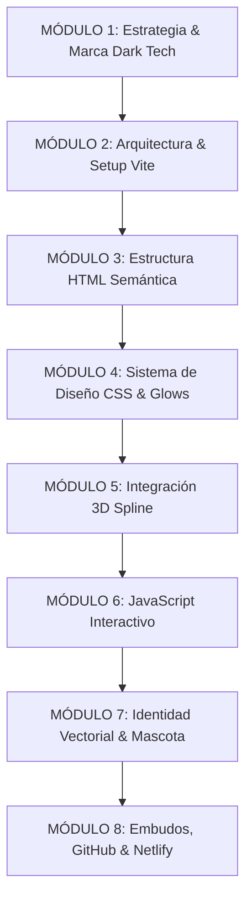

# 🎓 MASTERCLASS: Creación de Landing Pages 3D de Alta Conversión
## *De Cero a Producción con Spline 3D, Estética Dark Tech y Despliegue Automatizado*

**Autor:** A\DAN SOLUT\ONS  
**Nivel:** Intermedio a Avanzado  
**Stack Tecnológico:** HTML5 Semántico, Vanilla CSS (Design Tokens & Glassmorphism), Vanilla JavaScript ES6+, Spline 3D Viewer, Cal.com Embed, Vite, Git/GitHub y Netlify CI/CD.

---

## 🎯 Objetivo General del Curso
Capacitar al estudiante para concebir, diseñar, programar, auditar y desplegar una landing page corporativa de alto impacto visual y comercial, combinando elementos 3D interactivos, micro-animaciones fluidas, identidad de marca vectorizada y embudos de conversión directa (WhatsApp y agendamiento automatizado), sin depender de frameworks pesados que ralenticen la carga.

---

## 🧭 Mapa de Ruta Pedagógico (8 Módulos)

---

## 📚 Estructura Detallada de Módulos y Lecciones

### MÓDULO 1: Estrategia de Conversión y Branding B2B (Dark Tech)
*Comprender por qué las webs corporativas tradicionales aburren y cómo la estética Dark Tech retiene la atención ejecutiva.*

* **Lección 1.1:** Psicología de la Landing Page B2B: El viaje del usuario de 5 segundos.
* **Lección 1.2:** Manual de Identidad Visual: Paleta de color funcional (Fondo `#0B0F19`, Acento Cyan `#00D2FF`, Acento Secundario `#0051FF`, Éxito `#10B981`).
* **Lección 1.3:** Tipografía Técnica: Por qué *Space Grotesk* transmite innovación y precisión algorítmica.
* **Lección 1.4:** El Lema y la Propuesta de Valor: Transformar características aburridas en beneficios directos (*"Del caos operativo al piloto automático"*).

---

### MÓDULO 2: Entorno de Desarrollo Ultrarrápido con Vite
*Crear un entorno moderno, ligero y sin dependencias monstruosas.*

* **Lección 2.1:** ¿Por qué Vanilla Stack + Vite en lugar de frameworks pesados (React/Next.js) para landings de alto rendimiento?
* **Lección 2.2:** Inicialización de proyecto con `npm` y configuración de scripts (`dev`, `build`, `preview`).
* **Lección 2.3:** Estructura limpia de carpetas: `public/assets/`, `index.html`, `style.css`, `main.js`.
* **Lección 2.4:** Configuración de `.gitignore` para proteger el repositorio de `node_modules` y builds.

---

### MÓDULO 3: Arquitectura y Maquetación HTML5 Semántica
*Construir la columna vertebral orientada a SEO y accesibilidad.*

* **Lección 3.1:** Encabezados y Metaetiquetas críticas (Title, Description, Favicon dual SVG/PNG, Preloads).
* **Lección 3.2:** Navbar fija con contenedor flexible y enlaces de anclaje.
* **Lección 3.3:** El Hero de Pantalla Completa: Integración del contenedor Web Component 3D y overlay de texto inferior.
* **Lección 3.4:** Sección Servicios: Grid modular para los 5 pilares tecnológicos.
* **Lección 3.5:** Sección Método de Trabajo: Cómo estructurar un timeline de 5 fases para visualización fullscreen.
* **Lección 3.6:** Casos de Éxito & Testimonios: Estructura del carrusel 3D y prueba social.
* **Lección 3.7:** Sección de Contacto y Modal de Reservas Cal.com con soporte de accesibilidad.

---

### MÓDULO 4: Sistema de Diseño CSS Avanzado (Dark Tech & Glassmorphism)
*El arte de hacer que la web parezca una interfaz de software de ciencia ficción.*

* **Lección 4.1:** Creación del sistema de Design Tokens con variables CSS nativas (`:root`).
* **Lección 4.2:** Glassmorphism profesional: Fondos translúcidos con `backdrop-filter: blur(16px)` y bordes sutiles con gradiente.
* **Lección 4.3:** Sombras y Resplandores Neón: Cómo usar `box-shadow` multicapa y `filter: drop-shadow` sin saturar la GPU.
* **Lección 4.4:** Botones de Conversión: Gradientes interactivos (`background-size: 200%`), hover states y micro-animación pulsante `pulse-ring`.
* **Lección 4.5:** Responsive Design sin frameworks: Media queries clave para tablets (`1024px`) y smartphones (`768px`).

---

### MÓDULO 5: Integración 3D Interactiva con Spline
*El factor 'WOW' que transforma una web estática en una experiencia memorable.*

* **Lección 5.1:** Introducción a Spline 3D: Exportación a `.splinecode` para web components.
* **Lección 5.2:** Integración técnica del `<spline-viewer>` con script oficial modular.
* **Lección 5.3:** Optimización de carga: Cómo usar `<link rel="preload" as="fetch">` para evitar parpadeos.
* **Lección 5.4:** Truco Maestro de Frontend: Eliminación del watermark de Spline accediendo al Shadow DOM de forma limpia.
* **Lección 5.5:** Resolución de solapamientos: Cómo coordinar el texto 3D nativo de la escena con los llamados a la acción (CTAs) de HTML.

---

### MÓDULO 6: JavaScript Interactivo (Motion & State Logic)
*Dar vida a cada elemento con código nativo limpio, sin bibliotecas pesadas.*

* **Lección 6.1:** Efecto Máquina de Escribir (Typewriter): Algoritmo de mecanografía, borrado y pausas cíclicas.
* **Lección 6.2:** Process Progress Tracker: Animación temporizada de 0% a 100% sincronizada con activación visual de fases y clics manuales.
* **Lección 6.3:** 3D Coverflow Carousel: Matemáticas de carrusel con transformaciones 3D (`scale`, `translateX`, `opacity`), navegación por teclado, flechas y autoplay pausado al hover.
* **Lección 6.4:** Contadores Dinámicos con `IntersectionObserver`: Cómo animar números incrementales solo cuando el usuario hace scroll hacia ellos.
* **Lección 6.5:** Controlador del Modal de Cal.com: Bloqueo de scroll del body, soporte para tecla Escape y cierre al hacer clic fuera del modal.

---

### MÓDULO 7: Identidad Vectorial y Optimización de la Mascota Oficial
*De una imagen ráster a un logotipo vectorial escalable e inmune a fallos.*

* **Lección 7.1:** Procesamiento de imagen: Extracción algorítmica de transparencias preservando tubos de neón y resplandores cyan sin bordes cortados.
* **Lección 7.2:** Por qué los textos SVG en etiquetas `` fallan y cómo resolverlo vectorizando las fuentes en trazados matemáticos `<path d="...">`.
* **Lección 7.3:** Construcción del SVG oficial del logotipo combinando la mascota y la tipografía en un solo archivo autosuficiente.
* **Lección 7.4:** Estrategia de Favicons: Creación de versiones cuadradas en SVG y PNG para compatibilidad absoluta en navegadores y dispositivos móviles.

---

### MÓDULO 8: Estrategia Omnicanal de Conversión y Despliegue en Netlify
*Poner la web a vender y configurarla en un pipeline de integración continua.*

* **Lección 8.1:** Integración de WhatsApp B2B: Generación de enlaces `wa.me` con mensajes precargados contextuales orientados a proyectos empresariales.
* **Lección 8.2:** El Botón Flotante Fijo: Diseño no intrusivo con micro-animación pulsante adaptativa para desktop y mobile.
* **Lección 8.3:** Control de versiones con Git: Inicialización, confirmación semántica y subida a GitHub.
* **Lección 8.4:** Configuración de `netlify.toml`: Reglas de build (`npm run build`), directorio de salida (`dist`), redirecciones SPA (`/* -> /index.html`) y encabezados de seguridad.
* **Lección 8.5:** Despliegue continuo en Netlify y vinculación de dominios personalizados.

---

## 🛠️ Proyecto Práctico del Estudiante
Al finalizar el curso, cada estudiante habrá construido desde cero y desplegado en su propia URL de Netlify una landing page 3D profesional idéntica a la de **A\DAN SOLUT\ONS**, lista para ser utilizada como portafolio o para comercializar sus propios servicios.
