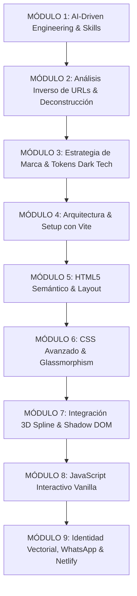

# 🎓 MASTERCLASS: Creación de Landing Pages 3D de Alta Conversión
## *Metodología AI-Driven: Deconstrucción de URLs con Skills, Spline 3D, Estética Dark Tech y Despliegue CI/CD*

**Autor:** A\DAN SOLUT\ONS  
**Nivel:** Intermedio a Avanzado  
**Stack Tecnológico:** Agentes de IA Asistidos (Skills & Web Scraping), HTML5 Semántico, Vanilla CSS (Design Tokens & Glassmorphism), Vanilla JavaScript ES6+, Spline 3D Viewer, Cal.com Embed, Vite, Git/GitHub y Netlify CI/CD.

---

## 🎯 Objetivo General del Curso
Capacitar al estudiante en la metodología moderna de **desarrollo asistido por Inteligencia Artificial (AI-Driven Development)**: aprender a dotar al agente de IA con **Skills personalizadas**, alimentar enlaces web de referencia para **deconstruir patrones visuales y de diseño**, y programar, auditar y desplegar una landing page corporativa de alto impacto con elementos 3D interactivos, micro-animaciones fluidas, identidad vectorial y embudos de conversión a WhatsApp y agenda.

---

## 🧭 Mapa de Ruta Pedagógico (9 Módulos)

---

## 📚 Estructura Detallada de Módulos y Lecciones

### MÓDULO 1: Ingeniería de Contexto con IA y Creación de Skills
*Cómo dotar a un agente de Inteligencia Artificial de conocimiento experto y reglas inviolables antes de escribir una sola línea de código.*

* **Lección 1.1:** El nuevo paradigma del desarrollo web con IA: De *"preguntar al chat"* a *"programar en pareja con contexto duradero"*.
* **Lección 1.2:** ¿Qué son los Skills en un agente de código (`.agents/skills/`)?: Frontmatter YAML, `SKILL.md` y archivos de recursos.
* **Lección 1.3:** Creación del Skill `estilo-marca`: Cómo fijar la paleta de colores, tipografías y reglas de tono en `recursos/estilo-visual.json` para que la IA nunca improvise ni alucine.
* **Lección 1.4:** Creación e inyección de Skills técnicas especializadas (ej. `spline-3d-integration` y `ui-ux-pro-max`).

---

### MÓDULO 2: Análisis Inverso de URLs y Deconstrucción Visual con IA
*El superpoder de alimentar enlaces web a la IA para clonar patrones, estructuras y sistemas de diseño sin empezar de cero.*

* **Lección 2.1:** Extracción automatizada de información visual: Cómo compartir una URL de referencia para que la IA audite el DOM, las clases CSS y la paleta cromática real.
* **Lección 2.2:** Deconstrucción de componentes UI: Reconocimiento de tarjetas, pills flotantes, efectos de brillo, carruseles y jerarquía visual.
* **Lección 2.3:** Generación del Manual de Identidad Visual a partir del análisis web (`MANUAL_IDENTIDAD_VISUAL.md`).
* **Lección 2.4:** La regla de oro del refactor asistido: *"NO realices cambios al diseño, solo vamos a editar la información"* (cómo proteger el CSS base mientras se transmuta el contenido).

---

### MÓDULO 3: Estrategia de Marca y Tokens Dark Tech (A\DAN SOLUT\ONS)
*Transformar el análisis técnico en una propuesta de valor comercial B2B irresistible.*

* **Lección 3.1:** Psicología de la Landing Page B2B: El viaje del usuario de 5 segundos.
* **Lección 3.2:** Paleta de Color Funcional: Fondo `#0B0F19`, Superficie `#161D2F`, Acento Cyan `#00D2FF`, Acento Secundario `#0051FF`, Éxito `#10B981`.
* **Lección 3.3:** Tipografía Técnica: Por qué *Space Grotesk* transmite innovación, precisión algorítmica y blindaje de datos.
* **Lección 3.4:** El Lema y la Promesa de Marca: Cómo redactar titulares de alto impacto (*"Del caos operativo al piloto automático"*).

---

### MÓDULO 4: Arquitectura y Setup Ultrarrápido con Vite
*Crear un entorno moderno, ligero y sin sobrecarga de frameworks innecesarios.*

* **Lección 4.1:** ¿Por qué Vanilla Stack + Vite en lugar de frameworks pesados (React/Next.js) para landings de alto rendimiento?
* **Lección 4.2:** Inicialización de proyecto con `npm` y configuración de scripts (`dev`, `build`, `preview`).
* **Lección 4.3:** Estructura limpia de carpetas: `public/assets/`, `index.html`, `style.css`, `main.js`.
* **Lección 4.4:** Configuración de `.gitignore` para proteger el repositorio de `node_modules` y builds.

---

### MÓDULO 5: Maquetación HTML5 Semántica y Arquitectura de Conversión
*Construir la columna vertebral orientada a SEO y accesibilidad.*

* **Lección 5.1:** Encabezados y Metaetiquetas críticas (Title, Description, Favicon dual SVG/PNG, Preloads).
* **Lección 5.2:** Navbar fija con contenedor flexible y enlaces de anclaje.
* **Lección 5.3:** El Hero de Pantalla Completa: Integración del contenedor Web Component 3D y overlay de texto inferior.
* **Lección 5.4:** Sección Servicios: Grid modular para los 5 pilares tecnológicos.
* **Lección 5.5:** Sección Método de Trabajo: Cómo estructurar un timeline de 5 fases para visualización fullscreen.
* **Lección 5.6:** Casos de Éxito & Testimonios: Estructura del carrusel 3D y prueba social en Telecomunicaciones.
* **Lección 5.7:** Sección de Contacto y Modal de Reservas Cal.com con soporte de accesibilidad.

---

### MÓDULO 6: Sistema de Diseño CSS Avanzado (Dark Tech & Glassmorphism)
*El arte de hacer que la web parezca una interfaz de software de ciencia ficción.*

* **Lección 6.1:** Creación del sistema de Design Tokens con variables CSS nativas (`:root`).
* **Lección 6.2:** Glassmorphism profesional: Fondos translúcidos con `backdrop-filter: blur(16px)` y bordes sutiles con gradiente.
* **Lección 6.3:** Sombras y Resplandores Neón: Cómo usar `box-shadow` multicapa y `filter: drop-shadow` sin saturar la GPU.
* **Lección 6.4:** Botones de Conversión: Gradientes interactivos (`background-size: 200%`), hover states y micro-animación pulsante `pulse-ring`.
* **Lección 6.5:** Responsive Design sin frameworks: Media queries clave para tablets (`1024px`) y smartphones (`768px`).

---

### MÓDULO 7: Integración 3D Interactiva con Spline
*El factor 'WOW' que transforma una web estática en una experiencia memorable.*

* **Lección 7.1:** Introducción a Spline 3D: Exportación a `.splinecode` para web components.
* **Lección 7.2:** Integración técnica del `<spline-viewer>` con script oficial modular.
* **Lección 7.3:** Optimización de carga: Cómo usar `<link rel="preload" as="fetch">` para evitar parpadeos.
* **Lección 7.4:** Truco Maestro de Frontend: Eliminación del watermark de Spline accediendo al Shadow DOM de forma limpia.
* **Lección 7.5:** Resolución de solapamientos: Cómo coordinar el texto 3D nativo de la escena con los llamados a la acción (CTAs) de HTML.

---

### MÓDULO 8: JavaScript Interactivo (Motion & State Logic)
*Dar vida a cada elemento con código nativo limpio, sin bibliotecas pesadas.*

* **Lección 8.1:** Efecto Máquina de Escribir (Typewriter): Algoritmo de mecanografía, borrado y pausas cíclicas.
* **Lección 8.2:** Process Progress Tracker: Animación temporizada de 0% a 100% sincronizada con activación visual de fases y clics manuales.
* **Lección 8.3:** 3D Coverflow Carousel: Matemáticas de carrusel con transformaciones 3D (`scale`, `translateX`, `opacity`), navegación por teclado, flechas y autoplay pausado al hover.
* **Lección 8.4:** Contadores Dinámicos con `IntersectionObserver`: Cómo animar números incrementales solo cuando el usuario hace scroll hacia ellos.
* **Lección 8.5:** Controlador del Modal de Cal.com: Bloqueo de scroll del body, soporte para tecla Escape y cierre al hacer clic fuera del modal.

---

### MÓDULO 9: Identidad Vectorial, WhatsApp B2B y Despliegue en Netlify
*Poner la web a vender y configurarla en un pipeline de integración continua.*

* **Lección 9.1:** De PNG a SVG Puro: Extracción algorítmica de transparencias de la mascota oficial (puercoespín neón) preservando el resplandor sin cortes duros.
* **Lección 9.2:** Por qué las fuentes fallan en etiquetas `` SVG y cómo solucionarlo vectorizando en `<path d="...">`.
* **Lección 9.3:** Estrategia Omnicanal de WhatsApp: Enlaces `wa.me` con mensajes precargados corporativos (*"Hola AIDAN SOLUTIONS..."*) y botón flotante con anillo de pulso neón.
* **Lección 9.4:** Control de versiones con Git: Inicialización, confirmación semántica y push a GitHub.
* **Lección 9.5:** Configuración de `netlify.toml`: Reglas de build (`npm run build`), directorio de salida (`dist`), redirecciones SPA (`/* -> /index.html`) y despliegue continuo en Netlify.

---

## 🛠️ Proyecto Práctico del Estudiante
Al finalizar el curso, cada estudiante habrá construido desde cero y desplegado en su propia URL de Netlify una landing page 3D profesional idéntica a la de **A\DAN SOLUT\ONS**, lista para ser comercializada o utilizada en su portafolio.
